# CinemaHall


Это приложение можно использовать для заказа билетов в кинотеатре.
## Используемые технологии:


Перед запуском установите:
- PostgreSQL 14
- Java 17
- Apache Maven 3.x

## Запуск приложения

1. Создайте базу данных cinemasb:
```sql
create database cinemasb;
```

2. Запуск приложения производится с использованием maven.
   Перейдите в корневой каталог проекта и в командной строке
   выполните команды:
```
    mvn clean install
    mvn spring-boot:run
```
### Описание:
Пользователю предлагается сначала зарегистрироваться
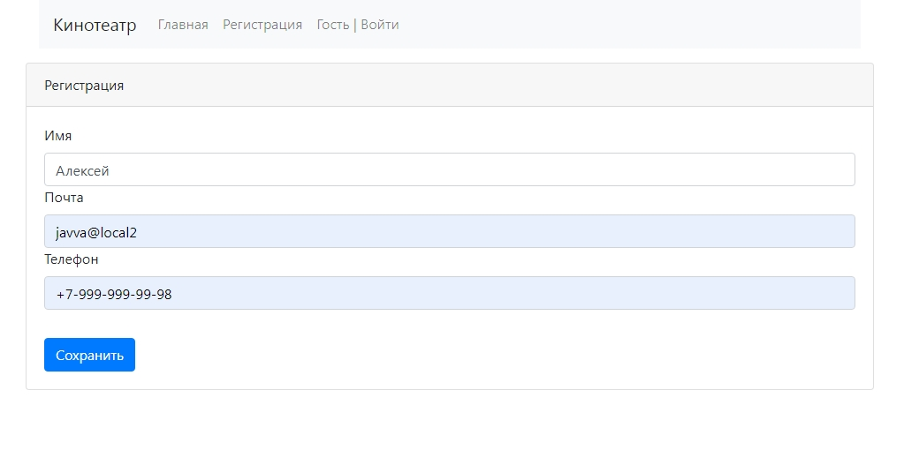

Если такого пользователя еще нет и регистрация прошла успешно
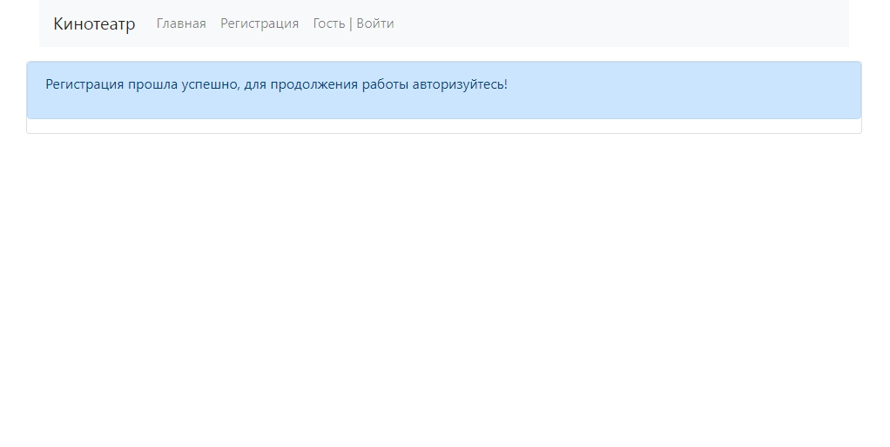

Если пользователь с такой почтой уже был зарегистрирован
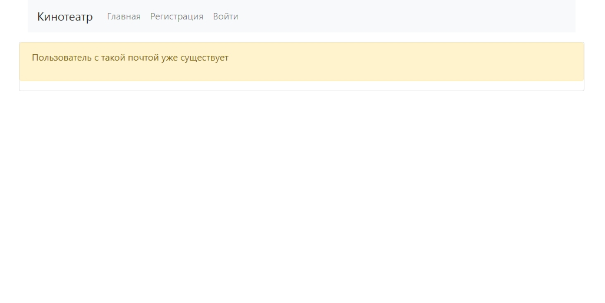

После регистрации пользователь будет перенаправлен на главную страницу
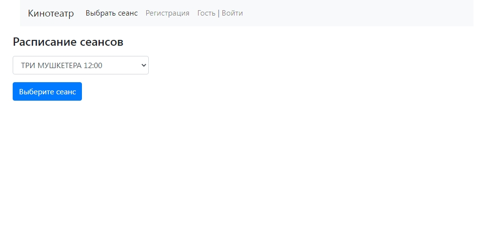

Ему надо будет пройти авторизацию
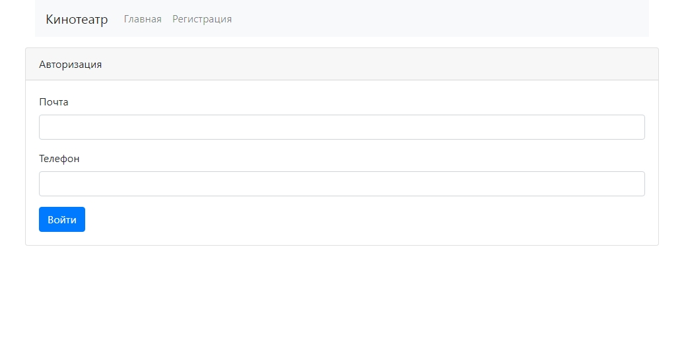

Если авторизация прошла неудачно, пользователь будет проинформирован
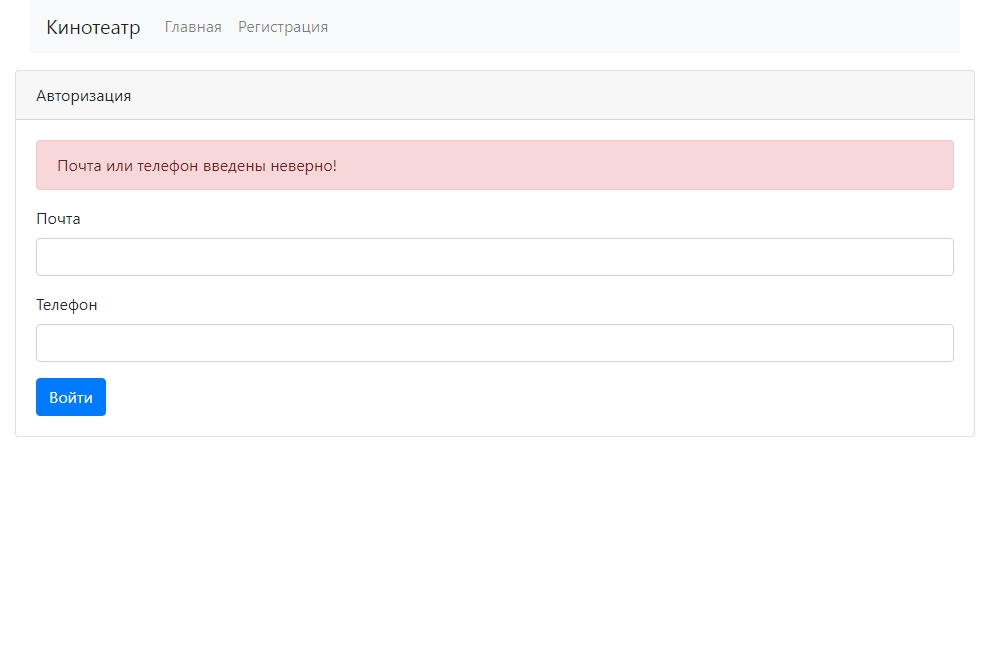

После успешной авторизации пользователь может выбрать сеанс
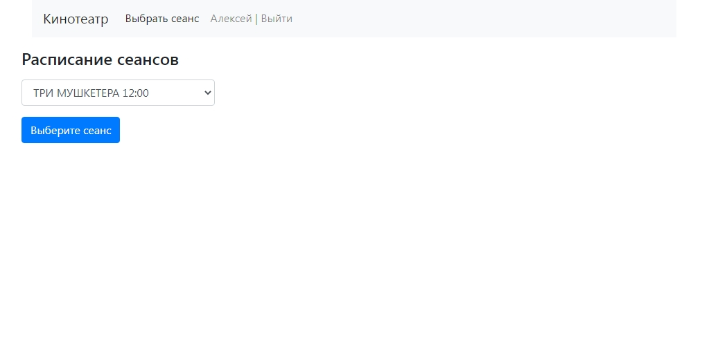

Можно выбрать свободное место
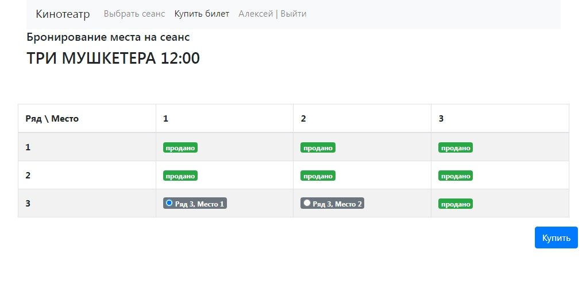

И подтвердить покупку
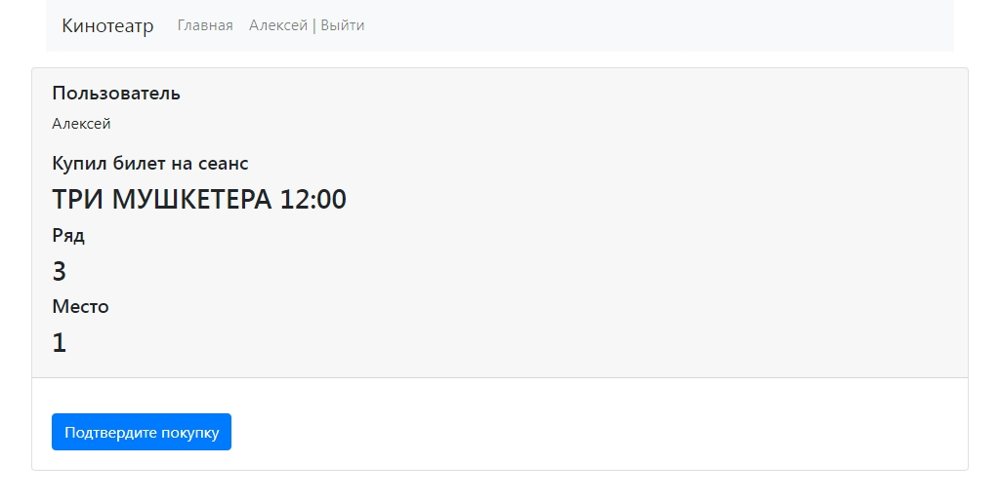

Если покупка прошла успешно, то купленное им место будет отображаться как занятое
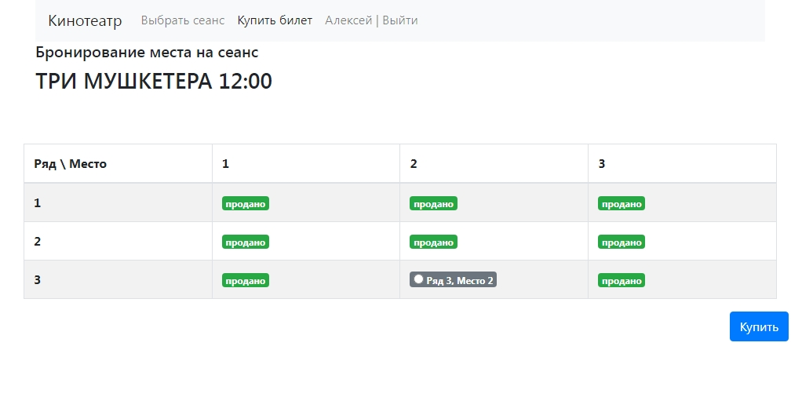

Если же кто-то опередил пользователя и место оказалось уже выкуплено, то появится сообщение
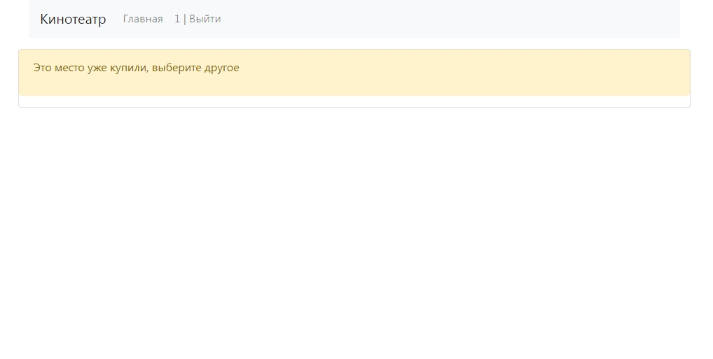

Связаться со мной можно по электронной почте a_esipov_it@list.ru
или в телеграм  @Alex46volokno


<div id="socials" align="center">
    <!-- <a href="linkedin-url">
    
  </a> -->

  <a href="https://t.me/alex46volokno">
    
  </a>
</div>
